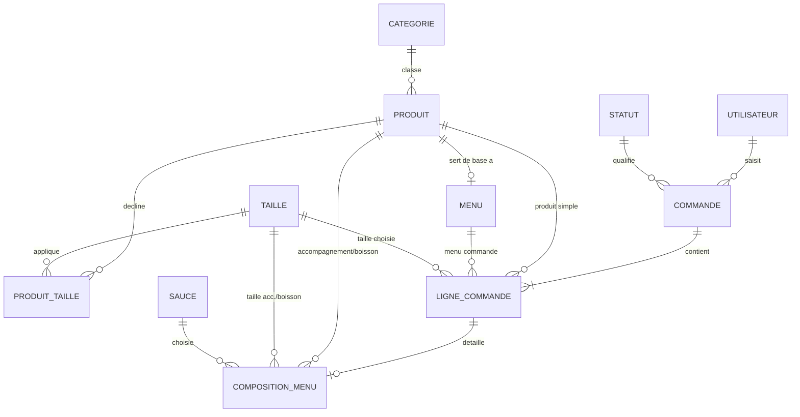

# Conception — Entités, attributs et relations (T01.1 / T01.2)

Ce document liste les entités du système Wacdo, leurs attributs, les relations entre elles et les règles de gestion associées. Il sert de base à la réalisation du MCD (`T01.3`) et du MPD (`T01.4`).

Notation des cardinalités : Merise (`0,1` / `1,1` / `0,n` / `1,n`).

---

## 1. Liste des entités et attributs (T01.1)

### Utilisateur
Compte interne du back-office (rôle Administration / Préparation / Accueil).

| Attribut | Description | Contrainte |
| --- | --- | --- |
| id | Identifiant unique | PK |
| nom | Nom de famille | requis |
| prenom | Prénom | requis |
| email | Identifiant de connexion | requis, unique |
| mot_de_passe | Hash du mot de passe (`password_hash`) | requis |
| role | Administration \| Préparation \| Accueil | requis |
| actif | Compte activé/désactivé | défaut `true` |
| date_creation | Horodatage de création | requis |

> Note technique (T04.1) : en PHP, ce rôle sera porté par l'héritage (`Utilisateur` classe de base, `Administrateur`/`Preparateur`/`Accueil` en sous-classes ou stratégie équivalente). Côté base de données, une seule table avec une colonne `role` suffit (pas besoin de 3 tables séparées).

### Categorie
Regroupe les produits (burger, accompagnement, boisson, dessert).

| Attribut | Description | Contrainte |
| --- | --- | --- |
| id | Identifiant unique | PK |
| nom | Libellé de la catégorie | requis, unique |

### Produit
Article vendable à l'unité (burger, accompagnement, boisson, dessert).

| Attribut | Description | Contrainte |
| --- | --- | --- |
| id | Identifiant unique | PK |
| nom | Nom du produit | requis |
| description | Description courte | optionnel |
| prix | Prix de base (produits sans taille : burger, dessert) | requis si pas de taille |
| categorie_id | Catégorie du produit | FK → Categorie |
| image | Nom/chemin du fichier image | optionnel |
| disponible | Produit activé/désactivé à la vente | défaut `true` |

### Taille
Options de taille pour accompagnements et boissons (Petite / Grande).

| Attribut | Description | Contrainte |
| --- | --- | --- |
| id | Identifiant unique | PK |
| libelle | "Petite" ou "Grande" | requis, unique |
| supplement | Supplément de prix (0 pour Petite, +0,50€ pour Grande) | requis |

### ProduitTaille
Table d'association : prix d'un produit pour une taille donnée (uniquement pour les catégories accompagnement/boisson).

| Attribut | Description | Contrainte |
| --- | --- | --- |
| produit_id | Produit concerné | FK → Produit |
| taille_id | Taille concernée | FK → Taille |
| prix | Prix pour ce couple produit/taille | requis |

### Sauce
Sauce au choix dans un menu.

| Attribut | Description | Contrainte |
| --- | --- | --- |
| id | Identifiant unique | PK |
| nom | Nom de la sauce | requis, unique |

### Menu
Formule associant un burger à un accompagnement + une boisson + une sauce au choix.

| Attribut | Description | Contrainte |
| --- | --- | --- |
| id | Identifiant unique | PK |
| nom | Nom du menu | requis |
| description | Description courte | optionnel |
| prix_base | Prix de base du menu (hors suppléments de taille) | requis |
| burger_id | Burger associé au menu | FK → Produit |
| image | Nom/chemin du fichier image | optionnel |
| disponible | Menu activé/désactivé à la vente | défaut `true` |

### Statut
Statut du cycle de vie d'une commande.

| Attribut | Description | Contrainte |
| --- | --- | --- |
| id | Identifiant unique | PK |
| libelle | "En attente" \| "En préparation" \| "Prête" \| "Livrée" | requis, unique |

### Commande
Commande passée sur la borne ou saisie par l'accueil (comptoir/téléphone).

| Attribut | Description | Contrainte |
| --- | --- | --- |
| id | Identifiant unique | PK |
| numero_affichage | Numéro communiqué au client (ticket) | requis |
| date_heure | Date/heure de passage de la commande | requis |
| statut_id | Statut courant | FK → Statut |
| montant_total | Total de la commande (calculé, figé) | requis |
| origine | "borne" \| "comptoir" \| "telephone" | requis |
| utilisateur_id | Agent Accueil ayant saisi la commande (null si borne) | FK → Utilisateur, nullable |

### LigneCommande
Une ligne de commande : soit un produit simple, soit un menu (jamais les deux).

| Attribut | Description | Contrainte |
| --- | --- | --- |
| id | Identifiant unique | PK |
| commande_id | Commande parente | FK → Commande |
| produit_id | Produit simple commandé | FK → Produit, nullable |
| menu_id | Menu commandé | FK → Menu, nullable |
| taille_id | Taille choisie (si produit simple avec taille) | FK → Taille, nullable |
| quantite | Quantité commandée | requis, > 0 |
| prix_unitaire | Prix unitaire facturé, figé au moment de la commande | requis |

### CompositionMenu
Détaille les choix faits pour une ligne de commande de type "menu" (accompagnement, boisson, tailles, sauce).

| Attribut | Description | Contrainte |
| --- | --- | --- |
| id | Identifiant unique | PK |
| ligne_commande_id | Ligne de commande "menu" concernée | FK → LigneCommande, unique |
| accompagnement_produit_id | Frites ou salade choisie | FK → Produit |
| accompagnement_taille_id | Taille de l'accompagnement | FK → Taille |
| boisson_produit_id | Boisson choisie | FK → Produit |
| boisson_taille_id | Taille de la boisson | FK → Taille |
| sauce_id | Sauce choisie | FK → Sauce |

---

## 2. Relations et cardinalités (T01.2)

| Relation | Cardinalités | Description |
| --- | --- | --- |
| Categorie — Produit | Categorie (1,1) — Produit (0,n) | Un produit appartient à une seule catégorie ; une catégorie regroupe plusieurs produits. |
| Produit — ProduitTaille | Produit (1,1) — ProduitTaille (0,n) | Un produit peut avoir jusqu'à 2 lignes de tailles (Petite/Grande). |
| Taille — ProduitTaille | Taille (1,1) — ProduitTaille (0,n) | Une taille s'applique à plusieurs produits. |
| Produit (burger) — Menu | Produit (0,1) — Menu (1,1) | Un menu référence exactement un burger ; un burger a au plus un menu associé. |
| Utilisateur — Commande | Utilisateur (0,1) — Commande (0,n) | Une commande saisie à l'accueil référence l'agent ; une commande borne n'a pas d'utilisateur. |
| Statut — Commande | Statut (1,1) — Commande (0,n) | Une commande a toujours un statut courant unique. |
| Commande — LigneCommande | Commande (1,1) — LigneCommande (1,n) | Une commande contient au moins une ligne ; une ligne appartient à une seule commande. |
| Produit — LigneCommande | Produit (0,1) — LigneCommande (0,n) | Une ligne référence un produit simple (si ce n'est pas un menu). |
| Menu — LigneCommande | Menu (0,1) — LigneCommande (0,n) | Une ligne référence un menu (si ce n'est pas un produit simple). |
| Taille — LigneCommande | Taille (0,1) — LigneCommande (0,n) | Taille choisie pour un produit simple avec option de taille. |
| LigneCommande — CompositionMenu | LigneCommande (1,1) — CompositionMenu (0,1) | Une composition n'existe que pour une ligne de type menu. |
| Produit — CompositionMenu (accompagnement) | Produit (0,1) — CompositionMenu (0,n) | Le produit choisi comme accompagnement du menu. |
| Produit — CompositionMenu (boisson) | Produit (0,1) — CompositionMenu (0,n) | Le produit choisi comme boisson du menu. |
| Taille — CompositionMenu (×2) | Taille (0,1) — CompositionMenu (0,n) | Taille de l'accompagnement et taille de la boisson choisies. |
| Sauce — CompositionMenu | Sauce (1,1) — CompositionMenu (0,n) | La sauce choisie pour le menu. |

### Aperçu visuel (brouillon, à formaliser en notation Merise pour T01.3)

---

## 3. Règles de gestion

- **RG1** — Un produit appartient à une seule catégorie.
- **RG2** — Un menu référence toujours exactement un burger ; un burger n'a au maximum qu'un seul menu associé.
- **RG3** — Seules les catégories "accompagnement" et "boisson" proposent un choix de taille (Petite/Grande) ; la taille Grande ajoute un supplément de +0,50€.
- **RG4** — Une commande possède à tout instant un statut unique parmi une liste fermée (En attente → En préparation → Prête → Livrée).
- **RG5** — Une ligne de commande référence soit un produit simple, soit un menu, jamais les deux à la fois (contrainte d'exclusivité applicative, vérifiée en base par un `CHECK` en T01.4).
- **RG6** — Une `CompositionMenu` n'existe que pour une ligne de commande référençant un menu.
- **RG7** — Le `prix_unitaire` d'une ligne de commande est figé au moment de la commande : il n'est jamais recalculé si le prix catalogue change ensuite.
- **RG8** — Un utilisateur back-office possède un rôle unique parmi Administration / Préparation / Accueil.
- **RG9** — Une commande peut ne pas avoir d'utilisateur associé (passée seule sur la borne) ou en avoir un (saisie comptoir/téléphone par un agent Accueil).
- **RG10** — La quantité d'une ligne de commande est strictement positive.

---

## 4. Prochaines étapes

- `T01.3` — Transformer ce dictionnaire en schéma conceptuel de données (MCD) formel, notation Merise.
- `T01.4` — Décliner en schéma physique (MPD) : tables SQL, types précis, clés primaires/étrangères, index.
- `T01.5` — Aligner la structure JSON (produits/menus/commande) sur ce modèle — voir `docs/maquette/produits.json` et `menus.json` comme point de départ.
