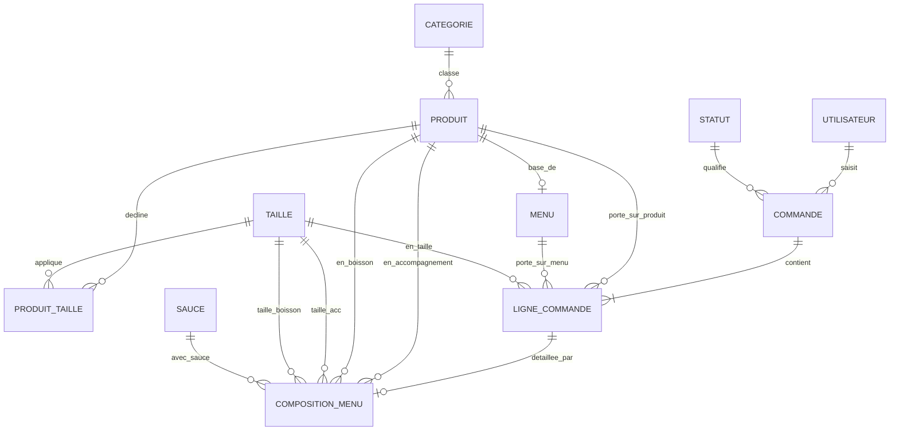

# Conception — Schéma conceptuel de données / MCD (T01.3)

Formalisation en notation Merise du dictionnaire des entités défini en `01-entites-et-relations.md`. Les identifiants (clés primaires) sont soulignés (`__attribut__`).

---

## 1. Entités (notation Merise)

```
CATEGORIE
  __id__
  nom

PRODUIT
  __id__
  nom
  description
  prix
  image
  disponible

TAILLE
  __id__
  libelle
  supplement

PRODUIT_TAILLE
  __produit_id__
  __taille_id__
  prix

SAUCE
  __id__
  nom

MENU
  __id__
  nom
  description
  prix_base
  image
  disponible

STATUT
  __id__
  libelle

UTILISATEUR
  __id__
  nom
  prenom
  email
  mot_de_passe
  role
  actif
  date_creation

COMMANDE
  __id__
  numero_affichage
  date_heure
  montant_total
  origine

LIGNE_COMMANDE
  __id__
  quantite
  prix_unitaire

COMPOSITION_MENU
  __id__
```

## 2. Associations et cardinalités

```
PRODUIT       (1,1) ─── CLASSE ───          (0,n) CATEGORIE
PRODUIT       (1,1) ─── DECLINE ───         (0,n) PRODUIT_TAILLE
TAILLE        (1,1) ─── APPLIQUE ───        (0,n) PRODUIT_TAILLE
PRODUIT       (0,1) ─── BASE_DE ───         (1,1) MENU
UTILISATEUR   (0,1) ─── SAISIT ───          (0,n) COMMANDE
STATUT        (1,1) ─── QUALIFIE ───        (0,n) COMMANDE
COMMANDE      (1,1) ─── CONTIENT ───        (1,n) LIGNE_COMMANDE
PRODUIT       (0,1) ─── PORTE_SUR_PRODUIT ─ (0,n) LIGNE_COMMANDE
MENU          (0,1) ─── PORTE_SUR_MENU ───  (0,n) LIGNE_COMMANDE
TAILLE        (0,1) ─── EN_TAILLE ───       (0,n) LIGNE_COMMANDE
LIGNE_COMMANDE(1,1) ─── DETAILLEE_PAR ───   (0,1) COMPOSITION_MENU
PRODUIT       (0,1) ─── EN_ACCOMPAGNEMENT ─ (0,n) COMPOSITION_MENU
PRODUIT       (0,1) ─── EN_BOISSON ───      (0,n) COMPOSITION_MENU
TAILLE        (0,1) ─── TAILLE_ACC ───      (0,n) COMPOSITION_MENU
TAILLE        (0,1) ─── TAILLE_BOISSON ───  (0,n) COMPOSITION_MENU
SAUCE         (1,1) ─── AVEC_SAUCE ───      (0,n) COMPOSITION_MENU
```

> Remarque : `COMPOSITION_MENU` porte quatre pattes vers `PRODUIT`/`TAILLE` (accompagnement + boisson, chacun avec sa taille) : en MPD (`T01.4`), cela se traduit par 4 clés étrangères distinctes vers les mêmes tables, ce qui est correct et courant (pas une erreur de modélisation).

## 3. Diagramme (Mermaid — rendu GitHub)



## 4. Validation du modèle

- Toutes les entités ont un identifiant unique. ✅
- Aucune redondance d'information entre entités (les prix des accompagnements/boissons par taille vivent uniquement dans `PRODUIT_TAILLE`). ✅
- Les règles de gestion (`RG1`–`RG10`, voir `01-entites-et-relations.md`) sont couvertes par les cardinalités ci-dessus. ✅
- Historisation : `LIGNE_COMMANDE.prix_unitaire` fige le prix facturé indépendamment d'une évolution ultérieure du catalogue (`RG7`). ✅
